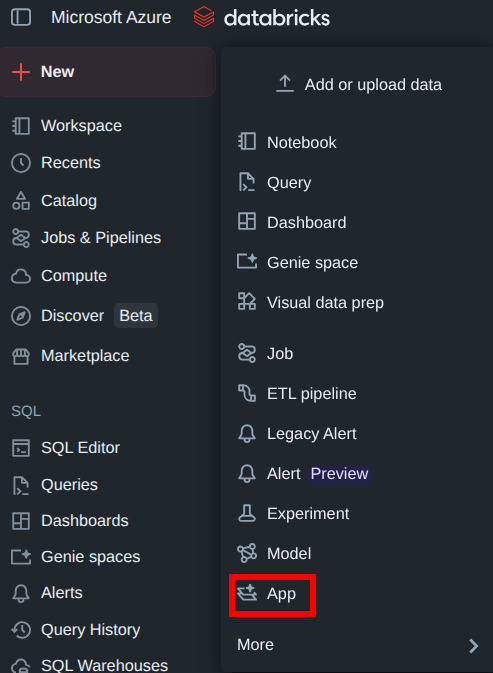
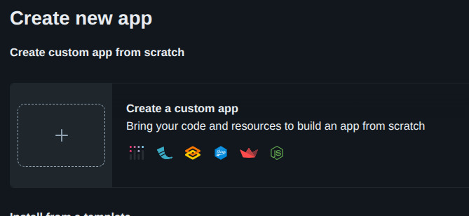
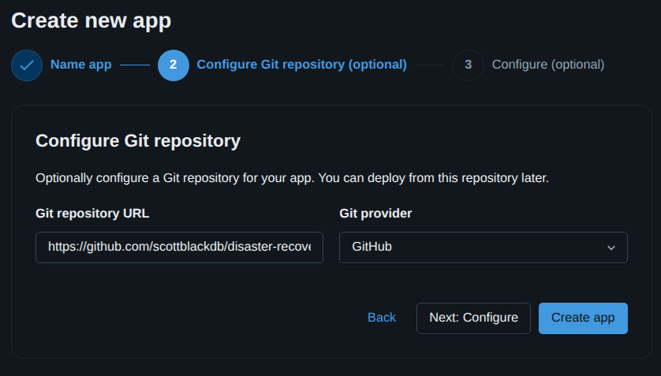
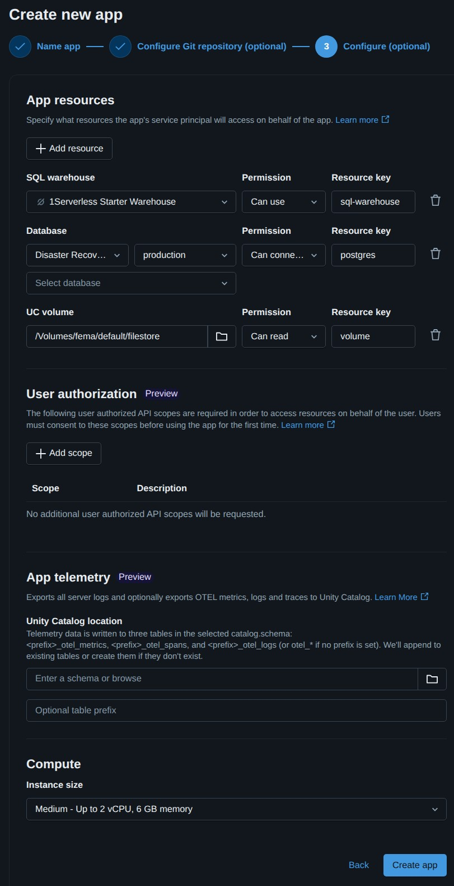
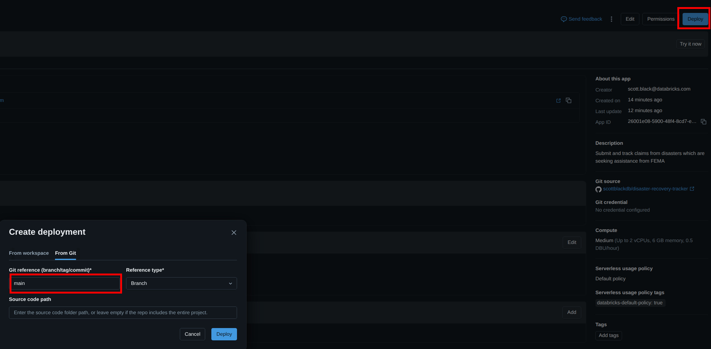

# Lab 1: Deploying a Databricks App

**Goal:** Sign in to your Databricks workspace, bring the **Disaster Recovery Tracker** sample app into the workspace from GitHub, and deploy it as a **Databricks App**.

**Repository:** [https://github.com/scottblackdb/disaster-recovery-tracker](https://github.com/scottblackdb/disaster-recovery-tracker)

---

## Before you start

- Use the **Databricks workspace URL** your instructor gives you (bookmark it if helpful).

---

## Part A — Understand the project (short read)

In a web browser open the [repository](https://github.com/scottblackdb/disaster-recovery-tracker).

Skim these items so deployment choices make sense:

| Item | Role |
|------|------|
| `app.yaml` | Tells Databricks Apps how to start the app (`uvicorn` on port 8000) and which resources (e.g. Lakebase) to attach. |
| `backend/` | Python **FastAPI** app (`backend.main:app`). |
| `frontend/` | Web UI built into static files for production (Dockerfile builds it; local dev may differ). |

---

## Part B — Open the workspace

1. Open a **new browser tab** (or window).
2. Go to the **Databricks workspace URL** provided by your instructor.
3. **Sign in** with the credentials.
4. Confirm you see the Databricks **workspace home**.

---

## Part C — Create a Databricks App

1. Click on the Create button. 

2. Select Custom App 

3. Name Your Application fema-claims-tracker-<your name> then click Next 

4. Configure Git Source. Add the git url of the project as the source for the app. Click Create App 

5. Configure App Resources. Grant access to Lakebase, the production branch, Sql Warehouse and a Unity Catalog Volume. Do not change any other settings. 
- **Lakebase** serves as the OLTP database and system of record for claims.
- **SQL Warehouse** serves as the data warehouse for analytics and heavy reporting.
- **UC Volume** serves as a filestore to hold non-tabular data such as images and files.

6. Click the Deploy button. Use **`main`** as the branch and then click Deploy 

7. It will take 2 to 3 minutes for the initial deployment. Future deployments will be much faster. After the deployment is complete click on the URL for the app and very you are able to login to the app.

## Congradulations On Creating Your Databricks App!

## Need help?

- **Build fails:** Open build logs; missing `app.yaml` or wrong root folder is a common mistake.
- **Runtime errors:** Check app logs and confirm the **`fema-disaster-recovery`** resource in `app.yaml` matches the Lakebase instance and that the app’s **Resources** list includes that database.
