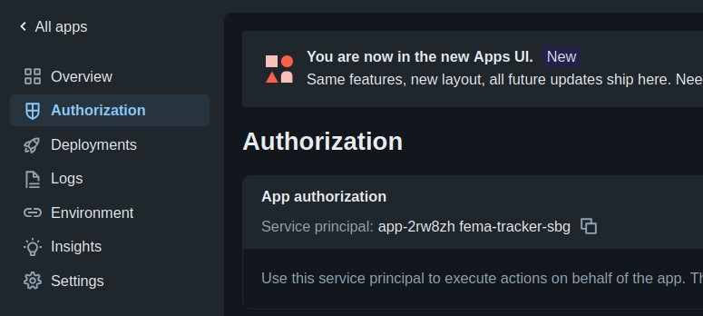

# Lab 1: Deploying a Databricks App

**Goal:** Sign in to your Databricks workspace, bring the **Disaster Recovery Tracker** sample app into the workspace from GitHub, and deploy it as a **Databricks App**.

**Repository:** [https://github.com/scottblackdb/disaster-recovery-tracker](https://github.com/scottblackdb/disaster-recovery-tracker)

---

## Before you start

- Use the **Databricks workspace URL** your instructor gives you (bookmark it if helpful).

---

## Part A — Understand the project (short read)

In a web browser open the [repository](https://github.com/scottblackdb/disaster-recovery-tracker).

Skim these items so deployment choices make sense:

| Item | Role |
|------|------|
| `app.yaml` | Tells Databricks Apps how to start the app (`uvicorn` on port 8000) and which resources (e.g. Lakebase) to attach. |
| `backend/` | Python **FastAPI** app (`backend.main:app`). |
| `frontend/` | Web UI built into static files for production (Dockerfile builds it; local dev may differ). |

---

## Part B — Open the workspace

1. Open a **new browser tab** (or window).
2. Go to the **Databricks workspace URL** provided by your instructor.
3. **Sign in** with the credentials provided by your instructor.
4. Confirm you see the Databricks **workspace home**.

---

## Part C — Create a Databricks App

**Ensure you are clicking Next when deploying the app and not Create button.**

1. Click on the Create button. 

2. Select Custom App 

3. Name Your Application **fema-claims-tracker-< your name >** then click Next. The max. length for an application is 30 characters so you may have to shorten your name.

4. Configure Git Source. Add the git url of the project as the source for the app. Click Create App 

5. Configure App Resources. Grant access to Lakebase, the production branch, Sql Warehouse (any warehouse will work) and a Unity Catalog Volume. Do not change any other settings. 
   - **Lakebase** serves as the OLTP database and system of record for claims.
   - **SQL Warehouse** serves as the data warehouse for analytics and heavy reporting.
   - **UC Volume** serves as a filestore to hold non-tabular data such as images and files. Ensure the permissions are set to **Read And Write**.

   - Leave the app telemetry blank

6. Click the Deploy button. Use **`main`** as the branch and then click Deploy 

7. It will take 2 to 3 minutes for the initial deployment. Future deployments will be much faster. 
8. The application will fail due to a lack of database permissions which you will next in the next part.

---

## Part D — Grant the App Service Principal Database Permissions

When Databricks Apps deploys your app it creates a dedicated **service principal (SP)** and automatically grants it the ability to *connect* to the Lakebase project you configured in Part C. However, connection access alone is not enough — the SP does not yet have permission to read or write any tables, sequences, or other database objects inside the database.

To keep this lab simple we will grant the SP the built-in **`databricks_superuser`** role, which gives it full control over all objects in the database.

> **⚠ Not a production pattern.** Granting `databricks_superuser` to an application principal is convenient for a short-lived lab environment but is not a best practice for production. In a real deployment you would create a dedicated role with only the privileges the app needs (e.g. `SELECT`, `INSERT`, `UPDATE`, `DELETE` on the specific tables), follow the principle of least privilege, and rotate credentials regularly.

### Steps

1. In the App view go to your application and then click on the **`Authorization`** on the left vertical menu. Make note of your applications's **service principal**.
 
2. In the Lakebase Postgres  view, open the **`Disaster Recovery Tracker`** Lakebase project.
3. Click on **`Overview`** under the Branch.
4. Click on **`Roles & Database`** tab.
5. Locate the service principal for your app.
6. Click 3 dot icon to the right and then click **`Edit`**.
7. Under **System roles**, select **`databricks_superuser`**.
8. Click **`Save`**.
9. Also grant your account the same role. Click the **`Add Role`** button and search for your email in the principal field.
10. Check the **databricks superuser** box and then click **Save**.
11. Return to your application overview page and click **`Deploy`** button.
12. Verify your application remains in a running state.

---

## Congratulations On Creating Your Databricks App!

## Need help?

- **Build fails:** Open build logs; missing `app.yaml` or wrong root folder is a common mistake.
- **Runtime errors:** Check app logs and confirm the **`disaster-recovery-lakebase`** resource in `app.yaml` matches the Lakebase project and that the app’s **Resources** list includes that database.
