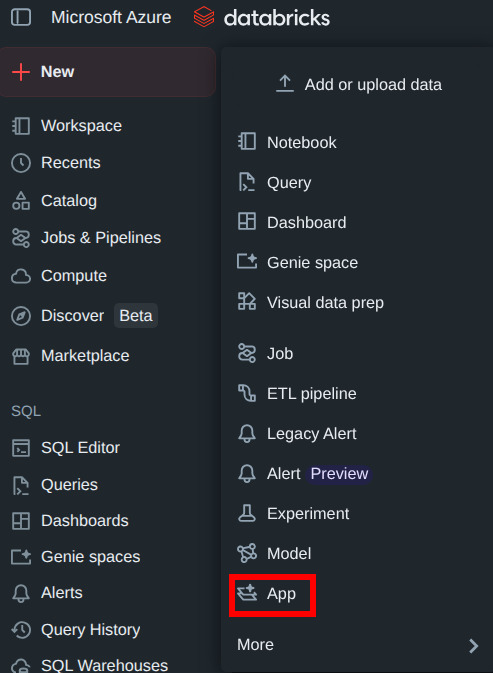
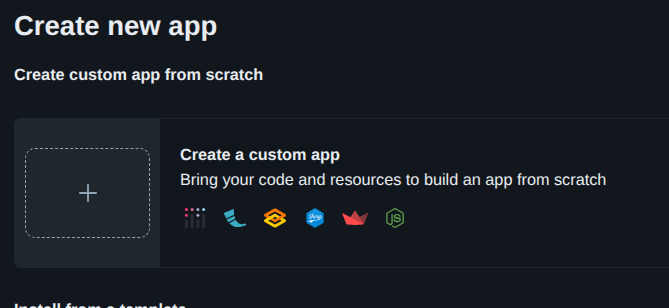
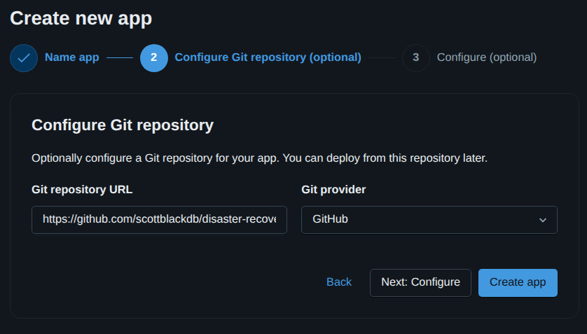
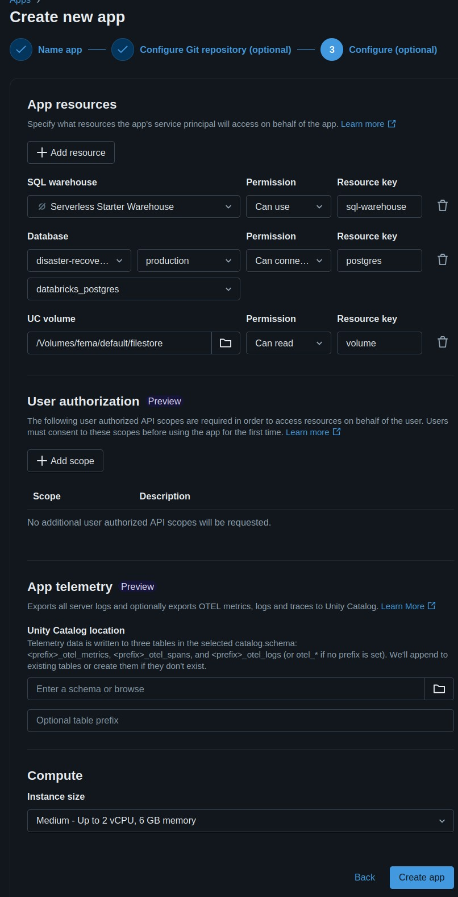
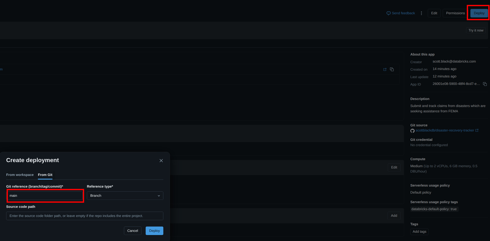

# Lab 1: Deploying a Databricks App

**Goal:** Sign in to your Databricks workspace, bring the **Disaster Recovery Tracker** sample app into the workspace from GitHub, and deploy it as a **Databricks App**.

**Repository:** [https://github.com/scottblackdb/disaster-recovery-tracker](https://github.com/scottblackdb/disaster-recovery-tracker)

---

## Before you start

- Use the **Databricks workspace URL** your instructor gives you (bookmark it if helpful).

---

## Part A — Understand the project (short read)

In a web browser open the [repository](https://github.com/scottblackdb/disaster-recovery-tracker).

Skim these items so deployment choices make sense:

| Item | Role |
|------|------|
| `app.yaml` | Tells Databricks Apps how to start the app (`uvicorn` on port 8000) and which resources (e.g. Lakebase) to attach. |
| `backend/` | Python **FastAPI** app (`backend.main:app`). |
| `frontend/` | Web UI built into static files for production (Dockerfile builds it; local dev may differ). |

---

## Part B — Open the workspace

1. Open a **new browser tab** (or window).
2. Go to the **Databricks workspace URL** provided by your instructor.
3. **Sign in** with the credentials provided by your instructor.
4. Confirm you see the Databricks **workspace home**.

---

## Part C — Create a Databricks App

1. Click on the Create button. 

2. Select Custom App 


3. Name Your Application fema-claims-tracker-<your name> then click Next. The max. length for an application is 30 characters so you may have to shorten your name.

4. Configure Git Source. Add the git url of the project as the source for the app. Click Create App 

5. Configure App Resources. Grant access to Lakebase, the production branch, Sql Warehouse (any warehouse will work) and a Unity Catalog Volume. Do not change any other settings. 
   - **Lakebase** serves as the OLTP database and system of record for claims.
   - **SQL Warehouse** serves as the data warehouse for analytics and heavy reporting.
   - **UC Volume** serves as a filestore to hold non-tabular data such as images and files. Ensure the permissions are set to **Read And Write**.

6. Click the Deploy button. Use **`main`** as the branch and then click Deploy 

7. It will take 2 to 3 minutes for the initial deployment. Future deployments will be much faster. After the deployment is complete click on the URL for the app and verify you are able to log in to the app.

---

## Part D — Resolve "permission denied for schema public"

On its first run, the app tries to create its tables (`fema_categories`, `claims`, `documents`, `claim_status_history`) in the Lakebase `public` schema. PostgreSQL 15+ tightened the default permissions on `public`, so on a brand‑new Lakebase the app's role cannot create objects there yet. You will see this in the app logs (and the app UI may show an error on first load):

```
psycopg.errors.InsufficientPrivilege: permission denied for schema public
LINE 1: CREATE TABLE IF NOT EXISTS fema_categories (
```

Grant your app's Postgres role permission to use and create objects in `public`, then redeploy.

1. In the Lakebase view, open the **`disaster-recovery-tracker`** project.
2. Click the **New Query** button (or open the **SQL Editor** for the Lakebase). This connects you as the Lakebase owner role (`databricks_superuser`), which has permission to grant on `public`.
3. Confirm you are connected to the **`databricks_postgres`** database (the default Lakebase database). Then run:

   ```sql
   GRANT USAGE, CREATE ON SCHEMA public TO PUBLIC;
   ```

   This grants every existing and future role in this Lakebase — including your app's service principal — the ability to use the `public` schema and create tables in it. (For a tighter grant, replace `PUBLIC` with the quoted service-principal role name of your app.)

4. Return to your app's page in Databricks and click **Deploy** again (branch `main`). Once the new deployment is **Running**, refresh the app URL — the bootstrap script will now succeed and you should land on the app's home page.

> If the error reappears after the redeploy, double-check that the `disaster-recovery-lakebase` resource on your app points at the `disaster-recovery-tracker` project / `production` branch / `primary` endpoint and that the resource has **Read And Write** access.

---

## Congratulations On Creating Your Databricks App!

## Need help?

- **Build fails:** Open build logs; missing `app.yaml` or wrong root folder is a common mistake.
- **Runtime errors:** Check app logs and confirm the **`disaster-recovery-lakebase`** resource in `app.yaml` matches the Lakebase project and that the app’s **Resources** list includes that database.
