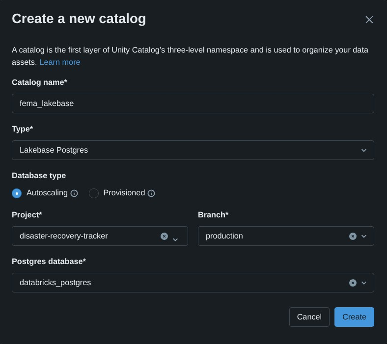

# Lab 2 (Instructor Only): Register Lakebase in Unity Catalog (Lakehouse Federation)

> **Audience:** Instructor only. Students should **not** run this lab. Once the instructor has registered the Lakebase database as a Unity Catalog catalog, students complete **Lab 2.1 (Federated)** — querying the live Lakebase tables directly, no sync or copy required.

**Goal:** Register the Disaster Recovery Tracker's **Lakebase (Postgres)** database directly in **Unity Catalog** using **Lakehouse Federation**, so the OLTP tables are queryable with SQL — live, with no replication step — for analytics and the AI/BI dashboard.

**Source (Lakebase / Postgres):** `disaster-recovery-tracker` Lakebase project, `databricks_postgres` database, `public` schema.

**Destination (Unity Catalog):** a new federated catalog named **`fema_lakebase`** → `fema_lakebase.public.*`

> **Use the catalog name `fema_lakebase` exactly.** The student dashboard file (`fema_claims_overview_federated.lvdash.json`) has this catalog name baked into all twelve of its dataset queries. Any other name means every student has to hand-edit twelve queries before their dashboard will run.

> **How this differs from the CDC/sync approach:** [`lab-2-instructor-sync-lakebase-to-lakehouse.md`](./lab-2-instructor-sync-lakebase-to-lakehouse.md) copies data out of Lakebase into Delta tables (`fema.bronze.*`), which then need `fema.silver.*` views to collapse the SCD Type 2 history back down to current state. Lakehouse Federation instead registers Lakebase itself as a **read-only Unity Catalog catalog** — there is no copy, no sync job, and no history table. Every query goes straight to Postgres and always reflects the current row. The two approaches land in **separate catalogs** (`fema` vs `fema_lakebase`) and don't collide, so you can run both if you want to demo the contrast side by side — just be clear with students which catalog their dashboard should point at.

---

## Before you start

- You must have **`CREATE CATALOG`** privileges on the Unity Catalog metastore (workspace admins have this by default).
- The Databricks App from **Lab 1** must already be deployed and have written at least one row into Lakebase (so the source tables exist and have data).
- Confirm the Lakebase project **`disaster-recovery-tracker`** is running and reachable from the workspace. *(This is the project ID created by `workshop_setup/setup_workshop.py`, which slugifies the `--lakebase-name` value. If you ran setup with a custom name, use that project instead.)*
- You will need a SQL warehouse with **serverless compute enabled** (shown as **Serverless** in the warehouse list). Non-serverless warehouses cannot query federated Lakebase catalogs and will return a permission error. *(Note that a warehouse of type **Pro** with serverless enabled — the default `Serverless Starter Warehouse` is one — works fine; it's the serverless setting that matters, not the Pro/Classic type.)*

---

## Part A — Register the Lakebase database as a Unity Catalog catalog

1. In the workspace left nav, switch to **Lakehouse** (the standard Databricks Data Science & Engineering view) if you're not already there.
2. Open **Catalog Explorer** and click the **`+`** button, then choose **Create a catalog**.
3. Fill out the **Create a new catalog** dialog:
   - **Catalog name:** `fema_lakebase` *(use this exact name — see the note at the top of this lab)*
   - **Type:** **Lakebase Postgres**
   - **Database type:** **Autoscaling**
   - **Project:** `disaster-recovery-tracker`
   - **Branch:** `production` *(the default branch created when the project was provisioned)*
   - **Postgres database:** `databricks_postgres`

4. Click **Create**.

Unity Catalog registers the database and exposes its Postgres schemas as UC schemas. The `public` schema (where the app's `bootstrap.sql` created the tables) will appear as `fema_lakebase.public`.

> **This catalog is strictly read-only.** Unity Catalog queries can never write back into Lakebase through this catalog — writes must still go through the app or a direct Postgres connection. This is expected and is what keeps the OLTP tables safe from analytics traffic.

---

## Part B — Verify the registration

1. In Catalog Explorer, expand `fema_lakebase` → `public`. You should see:
   - `claims`
   - `fema_categories`
   - `documents`
   - `claim_status_history`
2. Open the **SQL Editor** and attach to a **Serverless** SQL warehouse (required — a warehouse without serverless compute will fail with a permission error against a federated Lakebase catalog).
3. Run a quick check against each table:

```sql
SELECT COUNT(*) FROM fema_lakebase.public.claims;
SELECT COUNT(*) FROM fema_lakebase.public.fema_categories;
SELECT COUNT(*) FROM fema_lakebase.public.documents;
SELECT COUNT(*) FROM fema_lakebase.public.claim_status_history;
```

## Part C — Grant student access

The registering user becomes the catalog owner. Grant the workshop group (or `account users`) read access:

```sql
GRANT USE CATALOG ON CATALOG fema_lakebase TO `account users`;
GRANT USE SCHEMA ON SCHEMA fema_lakebase.public TO `account users`;
GRANT SELECT ON CATALOG fema_lakebase TO `account users`;
```

---

## You're done — Lakebase is now live-queryable through Unity Catalog

Students can now complete **Lab 2.1 (Federated)**, importing the AI/BI dashboard and querying `fema_lakebase.public.*` directly — no sync job, no history table, no silver views, and no propagation delay.

## Need help?

- **`PERMISSION_DENIED` when creating the catalog:** You need `CREATE CATALOG` on the metastore. Ask a metastore admin to grant it or to register the catalog for you.
- **Query fails with a permission error even though the catalog exists:** Confirm your SQL warehouse has **serverless compute enabled** — non-serverless warehouses cannot query federated Lakebase catalogs.
- **`PERMISSION_DENIED: Only READ credentials can be retrieved for foreign tables`:** You (or a student) tried to `INSERT`/`UPDATE`/`DELETE` through the federated catalog. This is expected — the catalog is read-only. Writes must go through the app or a direct Postgres connection.
- **New objects aren't showing up in Catalog Explorer:** Federated catalog metadata is cached. Right-click the catalog and choose **Refresh**, or wait a few minutes.
- **Trying to register a branch and it fails:** A branch inherits its parent project's registration — you cannot register a branch separately if the parent database is already registered. Register only the branch/database combination students will actually query.
- **`TABLE_OR_VIEW_NOT_FOUND` from the dashboard:** Confirm the catalog name and schema (`public`) match exactly what was used at registration time, and that the table names have no `_history` suffix (that convention is specific to the CDC/sync approach, not federation).
