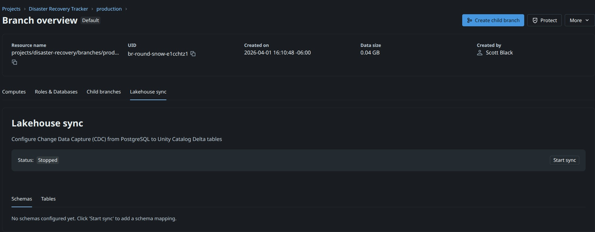
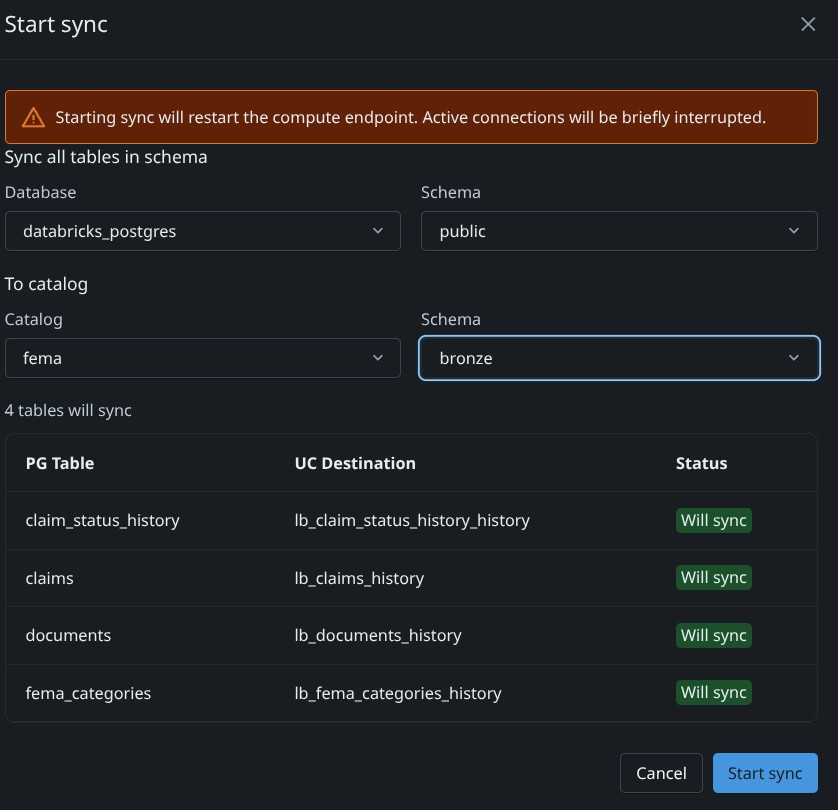
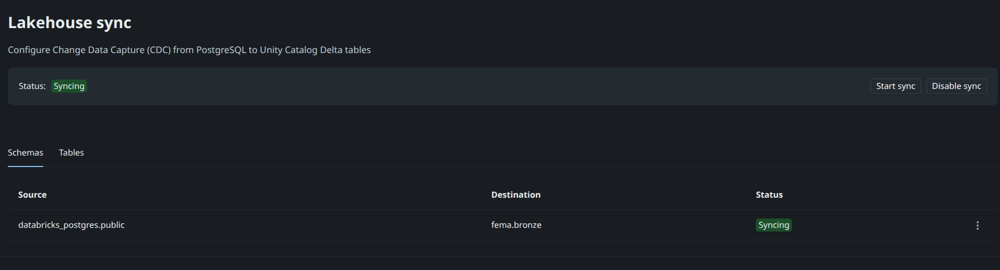

# Lab 2 (Instructor Only): Sync Lakebase to the Lakehouse

> **Audience:** Instructor only for Part A. Students should **not** run Part A. Once the instructor has completed Part A then students complete Part B. The output of this lab is synced tables in Unity Catalog.

**Goal:** Create **Lakebase synced tables** that continuously replicate the Disaster Recovery Tracker's OLTP data from **Lakebase (Postgres)** into the **Lakehouse (Unity Catalog Delta tables)** so the data is available for analytics and the AI/BI dashboard.

**Source (Lakebase / Postgres):** `Disaster Recovery Tracker` Lakebase Project, `databricks_postgres` database, `public` schema.

**Destination (Lakehouse / Unity Catalog):** `fema.bronze.*`

---

## Before you start

- You must be a **workspace admin** or have permission to create synced tables and write to `fema` catalog `bronze` schema.
- The Databricks App from **Lab 1** must already be deployed and have written at least one row into Lakebase (so the source tables exist and have data).
- Confirm the Lakebase project **`Disaster Recovery Tracker`** is running and reachable from the workspace.

---

## Part A — Confirm the source tables in Lakebase

1. In the workspace left nav, open **Compute → Database instances**.
2. Click the **`Disaster Recovery Tracker`** Lakebase project.
3. Click on the **`Overview`** from the left vertical menu.
4. Click on the **`Sync`** tab.
5. Click on the **`Start Sync`** button.

6. Fill out the sync form.
- Database: databricks_postgres
- To Catalog: fema
- Top Schema: public *(source schema in Lakebase)*
- Bottom Schema: Bronze *(destination schema in the Lakehouse catalog)*

7. Click the `Start` button

`There might be error about not having the required permissions. If you do have permissions this error can be ignored.`
---

## Part B — Verify the sync

1. Ensure your browser tab is on the Lakehouse view.
2. Open the **SQL Editor** and attach to a running SQL warehouse.
3. Run a quick check against each synced table:

```sql
SELECT COUNT(*) FROM fema.bronze.lb_claims_history;
SELECT COUNT(*) FROM fema.bronze.lb_fema_categories_history;
SELECT COUNT(*) FROM fema.bronze.lb_documents_history;
SELECT COUNT(*) FROM fema.bronze.lb_claim_status_history_history;
```

4. Submit a new claim through the app using the same steps as lab 1, wait ~30 seconds, then re-run the `claims` count to confirm new rows propagate.

Notice the table names have a `_history` suffix added to them and are SCD TYPE 2, meaning they show the full history of changes to each record.

---

## Part C — Create the Silver views

The bronze tables are SCD Type 2, so they include every historical version of every row plus the metadata columns `__START_AT` and `__END_AT`. The AI/BI dashboard (Lab 2.1) and the Genie space (Lab 3) are written against a clean, **current-state** view of the data — `fema.silver.*`. Create those views once now and the downstream labs will work without modification.

1. In the **SQL Editor**, attached to a running SQL warehouse, run:

   ```sql
   CREATE SCHEMA IF NOT EXISTS fema.silver;

   -- Latest CDC version per claim, excluding deletes
   CREATE OR REPLACE VIEW fema.silver.claims AS
   SELECT *
   FROM (
     SELECT
       *,
       ROW_NUMBER() OVER (PARTITION BY id ORDER BY _pg_lsn DESC) AS rn
     FROM fema.bronze.lb_claims_history
     WHERE _pg_change_type IN ('insert', 'update_postimage', 'delete')
   )
   WHERE rn = 1
     AND _pg_change_type != 'delete';

   -- Latest CDC version per FEMA category, excluding deletes
   CREATE OR REPLACE VIEW fema.silver.fema_categories AS
   SELECT *
   FROM (
     SELECT
       *,
       ROW_NUMBER() OVER (PARTITION BY id ORDER BY _pg_lsn DESC) AS rn
     FROM fema.bronze.lb_fema_categories_history
     WHERE _pg_change_type IN ('insert', 'update_postimage', 'delete')
   )
   WHERE rn = 1
     AND _pg_change_type != 'delete';

   -- Latest CDC version per document, excluding deletes
   CREATE OR REPLACE VIEW fema.silver.documents AS
   SELECT *
   FROM (
     SELECT
       *,
       ROW_NUMBER() OVER (PARTITION BY id ORDER BY _pg_lsn DESC) AS rn
     FROM fema.bronze.lb_documents_history
     WHERE _pg_change_type IN ('insert', 'update_postimage', 'delete')
   )
   WHERE rn = 1
     AND _pg_change_type != 'delete';

   -- Latest CDC version per claim_status_history row, excluding deletes
   CREATE OR REPLACE VIEW fema.silver.claim_status_history AS
   SELECT *
   FROM (
     SELECT
       *,
       ROW_NUMBER() OVER (PARTITION BY id ORDER BY _pg_lsn DESC) AS rn
     FROM fema.bronze.lb_claim_status_history_history
     WHERE _pg_change_type IN ('insert', 'update_postimage', 'delete')
   )
   WHERE rn = 1
     AND _pg_change_type != 'delete';
   ```

2. Quick sanity check — counts on the silver views should match (or be slightly less than) their bronze counterparts:

   ```sql
   SELECT 'claims' AS object, COUNT(*) AS row_count FROM fema.silver.claims
   UNION ALL SELECT 'fema_categories', COUNT(*) FROM fema.silver.fema_categories
   UNION ALL SELECT 'documents',       COUNT(*) FROM fema.silver.documents
   UNION ALL SELECT 'status_history',  COUNT(*) FROM fema.silver.claim_status_history;
   ```

   The silver counts should match the bronze counts on a fresh workshop because no rows have been updated yet. After students start editing claims in Lab 1, the silver counts will stay flat (one row per current claim) while the bronze `lb_claims_history` count grows (one row per version).

> **Why views, not tables?** Views always reflect the latest state of the underlying synced tables — there's nothing to refresh, schedule, or back-fill. The earlier `GRANT … ON CATALOG fema TO 'account users'` from the workshop setup script means students can already `SELECT` from these views without any extra grants.

---

## You're done — the Lakehouse is now in sync with Lakebase

The students can now import the AI/BI dashboard and immediately see live data flowing from Lakebase through the synced tables.

## Need help?

- **Synced table stuck in "Provisioning":** Confirm the Lakebase project is running and that the source table has a primary key.
- **`TABLE_OR_VIEW_NOT_FOUND` from the dashboard:** The destination catalog/schema/table names must match `fema.bronze.lb_<source_name>_history` exactly.
- **No new rows showing up:** Check the synced table's **Sync status** tab for the last successful sync timestamp and any error messages.
