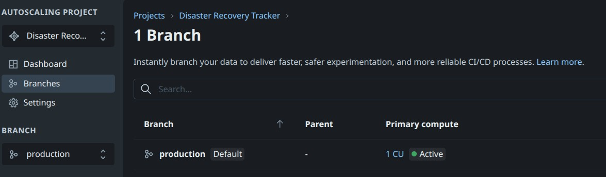
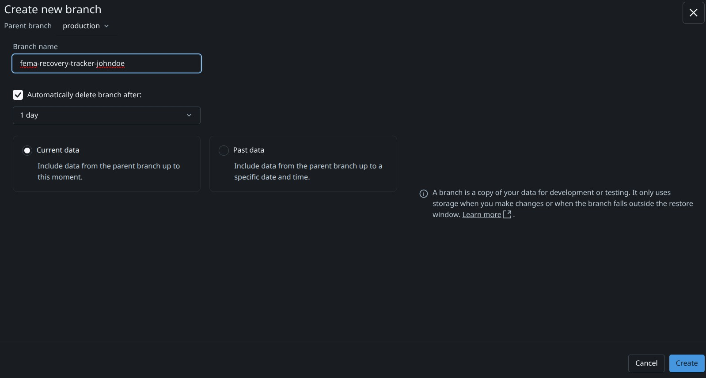
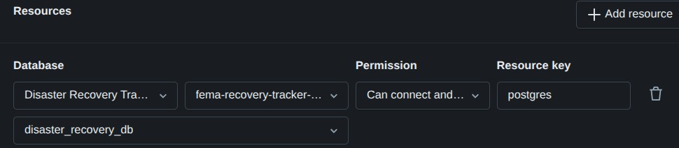

# Lab 4: Lakebase Branching, Autoscaling, and Pointing the App at a Branch

**Goal:** Create your own **branch** of the `Disaster Recovery Tracker` Lakebase database, take a quick tour of **Lakebase autoscaling**, and then switch the Databricks App from **Lab 1** to run against your new branch — all without touching the production data the rest of the workshop is using.

---

## Why branches?

Lakebase branches are **copy-on-write** clones of a Postgres database. Creating one is essentially instant, costs nothing extra at rest, and gives you a fully writable copy of all the claims data. They're the easiest way to:

- Try schema changes without breaking the live app.
- Hand each developer (or each student!) an isolated sandbox.
- Reset to a known-good state by dropping the branch and creating a new one.

---

## Before you start

- You completed **Lab 1**, so the Databricks App `fema-claims-tracker-<your name>` exists.
- You can **edit your own app's resources** (you deployed it, so you should).
- You will **not** change any production / main-branch data in this lab.

---

## Part A — Open the Lakebase project

1. In the Databricks workspace top right view switcher nav, click **Lakebase Postgres**.
2. Click the **`Disaster Recovery Tracker`** project.
3. Confirm the project status shows **Running** before continuing.
4. On the left vertical menu select **Branches**. You should see a single existing branch named **`production`** — that is currently serving the workshop's production data and the Lab 2 dashboard.

---

## Part B — Create your own branch

1. From the **Branches** tab, click **New Branch** button in the top right corner.
2. **Name:** `disaster-recovery-tracker-<your-name>` (for example `fema-disaster-recovery-johndoe`). Lowercase letters, numbers, and hyphens only.
3. **Parent branch:** **`production`**.
4. Ensure the checkbox to delete after 1 day remains checked.
5. **Branch from:** **Latest** (point-in-time = now). This snapshots all four tables (`claims`, `fema_categories`, `documents`, `claim_status_history`) at the current moment.
6. Click **Create**.

7. After creating the branch a dialog will show the connection information. Click the close button.

The branch typically becomes available in just a few seconds regardless of database size. When it's ready it will show its own **connection endpoint** (host + port). You now have a private, fully writable copy of the FEMA database that **nobody else in the workshop can see or affect**.

> Behind the scenes Lakebase didn't physically copy any data — it created copy-on-write metadata. Reads from your branch fall through to the parent's storage until you write something, at which point only the changed pages are diverged. That's why branching is fast and cheap.

---

## Part C — Tour autoscaling and enable scale-to-zero on your branch

Lakebase Postgres autoscales **compute** independently of storage — that's how branches stay cheap and how you only pay for the work you actually do.

> Only change settings on **your own** `disaster-recovery-tracker-<your-name>` branch in this part. **Do not** change `production`'s settings — that branch is shared with the rest of the class.

### Tour the settings

1. From the `Disaster Recovery Tracker` project page, open the **Branches** tab and click your **`disaster-recovery-tracker-<your-name>`** branch.
2. Open the branch's **Compute** (or **Capacity** / **Settings**) tab.
3. Locate and **observe** these settings — leave them at their current values:

| Setting | What it does |
|---|---|
| **Minimum capacity** | The smallest size the branch's compute will scale **down** to when traffic is light. Measured in CUs (capacity units). |
| **Maximum capacity** | The largest size the branch's compute will scale **up** to under load. It grows toward this value as queries queue up. |
| **Scale to zero** (a.k.a. **Auto-suspend**) | If enabled, the branch's compute pauses entirely after a period of inactivity, dropping compute cost to **$0**. The first query after a pause incurs a brief cold-start. |
| **Auto-resume** | When scale-to-zero is on, the compute automatically wakes back up the moment a query arrives. The user sees a one-time delay; nothing fails. |
| **Read-replica scaling** | Whether read-only replicas can be added under heavy read load. |

4. Hover over the **capacity history graph** (if shown). You'll see how the branch's CU consumption rises and falls with activity.

### Enable scale-to-zero on your branch

This is the **one setting** you should adjust in this lab — and only on your own branch.

1. Find the **Scale to zero** (or **Auto-suspend**) toggle on your branch's compute settings.
2. If it is **already on**, leave it on and skip to **What to take away** below.
3. If it is **off**, switch it **on**.
   - Confirm the **inactivity timeout** (e.g. 5 minutes) — the default is fine.
4. Click **Save** / **Apply** to confirm the change.

> Make sure the URL / breadcrumb still says you are on `disaster-recovery-tracker-<your-name>` before you click Save. If it shows `production`, back out and re-navigate via **Branches → `disaster-recovery-tracker-<your-name>` → Compute**.

### What to take away

- The instance you've been using all workshop has been **silently scaling itself** the whole time. You never told it how big to be — Lakebase figured it out.
- With scale-to-zero on, when you walk away from your branch tonight it stops billing you for compute entirely. The first query tomorrow auto-resumes it within a couple of seconds — no manual restart required.
- These autoscaling controls exist **per branch**, so your sandbox can scale independently from production: aggressive scale-to-zero on your dev branch, more conservative settings on `production`.

---

## Part D — Point your Databricks App at your new branch

Now we'll switch your `fema-claims-tracker-<your name>` app to read from and write to **your** branch instead of `production`. Production data stays exactly as it is for everyone else — your app will just see the snapshot you took in Part B and any changes **you** make from here on.

1. From the top right view switcher, click **Databricks Apps** and open your **`fema-claims-tracker-<your name>`** app.
2. From the vertical left menu click **Settings**.
3. Go to the **Resources** section.
4. Find the existing **Lakebase** resource that's wired up to the `Disaster Recovery Tracker` instance — it's the one named `disaster-recovery-lakebase` in `app.yaml`.
5. Change the **branch** dropdown from **`production`** to your new branch, **`disaster-recovery-tracker-<your-name>`**.

6. Leave every other field (database, role, permissions) exactly as it was.
7. Click **Save**.
8. Back on the app's main page, click **Deploy** and choose branch **`main`** of the **Git repository** (we are only re-deploying the app code with the new resource binding — we are **not** changing anything in Git).
9. Wait for the deployment to turn green, then click the app's **URL** to open it.

### Verify you're on your branch

1. In the running app, **submit a brand-new claim** (use the steps from **Lab 1.1**) — for example, *"Hurricane TestBranch — \<your name\>"*.
2. Open the **AI/BI dashboard from Lab 2** in another tab. The dashboard reads from `fema.bronze.*`, which is still synced from the **`production`** branch.
3. Refresh the dashboard.
4. **You should NOT see your test claim on the dashboard.** That's the proof that your app is now writing to your branch, completely isolated from production.
5. To see your branch's data, query it directly from the SQL editor. Ensure you are on the Lakebase Postgres view, Disaster Recovery project and your branch, then run:

```sql
SELECT incident_name, applicant_name, submitted_at
FROM public.claims
ORDER BY submitted_at DESC
LIMIT 10;
```

Your test claim should show up here.

### Clean up (optional)

When you're done experimenting, you can either:

- Leave the branch — it's autoscaled and (if scale-to-zero is on) costs almost nothing while idle.
- Delete it from the **Branches** tab; the parent branch is unaffected.

If you delete the branch, switch your app's Lakebase resource back to **`production`** before re-deploying, otherwise the app will fail to start.

## Congratulations — you have a personal, isolated, autoscaled Postgres branch wired up to your app!

You've now seen one of the most important Lakebase patterns: **branch the database, not the app**. The same compiled app, the same `app.yaml`, the same Git commit — all you changed was a single dropdown — now runs against a private database that you can break, reset, or throw away without affecting anyone else.

## Need help?

- **"Branch is provisioning" forever:** Refresh the page; if it's still stuck after a few minutes, the parent instance may be paused — open it once to wake it and try again.
- **App won't deploy after the resource change:** The app's Postgres role needs `CONNECT` on the new branch. Open the branch's **Permissions** tab and confirm the app's service principal is granted access.
- **You see production data in your app even after switching branches:** You probably forgot to **Deploy** after editing the resource. Resource changes are applied at deploy time.
- **You enabled scale-to-zero on the wrong branch:** If the breadcrumb shows `production`, immediately revert the change (toggle scale-to-zero back to its previous value and Save), then re-navigate to **Branches → `disaster-recovery-tracker-<your-name>` → Compute** before adjusting settings.
